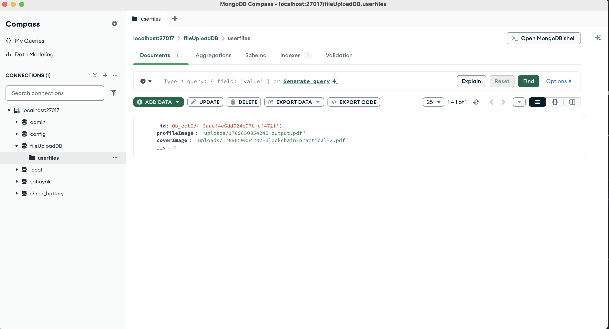

# Image Upload Node.js App

This project is a simple Node.js application for uploading profile and cover images using Express, Multer, MongoDB, and EJS.

It stores the uploaded files in the `uploads/` folder and saves the file paths in a MongoDB collection.

## Screenshot




## Features

- Upload two images at once: `profileImage` and `coverImage`
- Save files locally in the `uploads/` directory
- Store image paths in MongoDB using Mongoose
- Render a basic upload form with EJS

## Tech Stack

- Node.js
- Express.js
- Multer
- MongoDB
- Mongoose
- EJS

## Project Structure

```bash
Image_upload_nodejs/
├── index.js
├── package.json
├── readme.md
├── uploads/
└── views/
    └── homepage.ejs
```

## Prerequisites

Before running the app, make sure you have:

- Node.js installed
- MongoDB running locally
- A local MongoDB database available at:

```bash
mongodb://127.0.0.1:27017/fileUploadDB
```

## Installation

Clone the project and install dependencies:

```bash
npm install
```

## Run the Application

Start the server with:

```bash
npm start
```

The app runs on:

```bash
http://localhost:8000
```

## How It Works

1. Open the app in the browser.
2. Select a profile image and a cover image.
3. Submit the form to `/upload`.
4. Multer saves each uploaded file in the `uploads/` folder.
5. Mongoose saves the file paths to the MongoDB database.
6. The page redirects back to the home page after a successful upload.

## Form Endpoint

The upload form sends a `POST` request to:

```bash
/upload
```

This route uses:

```js
uploads.fields([{ name: "profileImage" }, { name: "coverImage" }]);
```

So both files are accepted in the same request.

## Notes

- The application expects MongoDB to be running locally.
- The `uploads/` folder should exist before uploading files.
- The database name used in this app is `fileUploadDB`.

## Troubleshooting

If the app does not work:

- Start MongoDB locally.
- Make sure the `uploads/` folder exists.
- Check the terminal for database connection or upload errors.

## License

This project is for learning and demonstration purposes.

